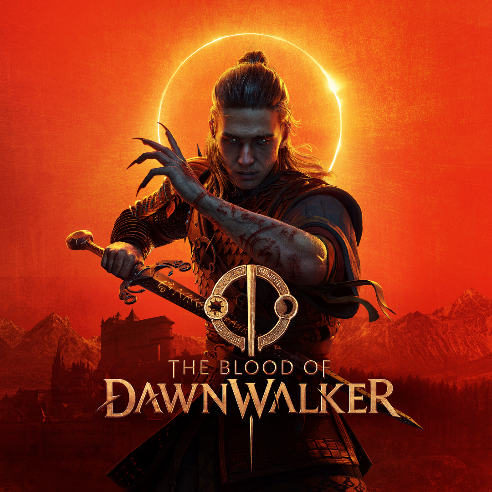

# The Blood of Dawnwalker — Trainer & Cheat Table (2026)

Free, open-source **trainer** and **Cheat Engine table** for *The Blood of Dawnwalker* (Rebel Wolves / Bandai Namco, Steam build, Unreal Engine 5). Single-player only. No Denuvo, no anti-cheat conflicts.

## Features

- God Mode / Ignore Hits
- Infinite Health, Stamina, Activation Charge
- Instant Ability Cooldown
- Zero Weight / Unlimited Carry
- Infinite Consumables
- Edit Money, Skill Points, Corruption Exp
- Super Damage / One-Hit Kills
- Set Game Speed, Move Speed, FOV
- Teleport & Save Location

*(Adjust this list to match exactly what your table/trainer supports — precision here matters more than length for search matching.)*

## Download

👉 Get the latest version from the **[Releases](../../releases)** page — always download from Releases, never from a third-party mirror.

Each release includes:
- `BloodOfDawnwalker_Trainer.exe`
- `BloodOfDawnwalker_CheatTable.CT` (for Cheat Engine)
- `SHA256SUMS.txt` — verify your download before running it

## Compatibility

| Game Version | Trainer Version | Status |
|---|---|---|
| Steam build (latest) | v1.0 | ✅ Working |

Update this table every time the game patches — outdated compatibility info is the #1 reason people bounce off trainer repos and never come back.

## Installation

1. Download the latest release archive from [Releases](../../releases)
2. Verify the SHA-256 checksum against `SHA256SUMS.txt`
3. Extract, run the game, then run the trainer/table as Administrator
4. Load a save, then toggle the options you want

## Safety

- Single-player, offline use only
- No online/Steam Workshop interaction
- Scanned with VirusTotal — link included in each Release description
- Achievements will be disabled while cheats are active (standard Unreal Engine behavior)

## Disclaimer

Not affiliated with Rebel Wolves or Bandai Namco. Use at your own risk — always back up your save files before use. This tool modifies game memory only; it does not alter game files.

## Credits

Built with [Cheat Engine](https://www.cheatengine.org/). Thanks to the community testers who verified offsets across patches.
